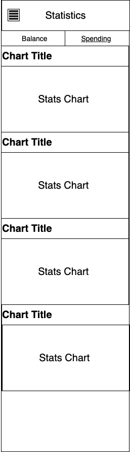

## Sitemap 

## Prototype

Prototype is now live: https://jenniferzeng157183.invisionapp.com/console/share/HQ34WVKQVW

## Wireframe 

Wireframe: https://app.diagrams.net/#G10-UZorXQMPOrRdCcepTYEaD2NRb1sGJm

More wireframes are attached in ./ux-design/prototype

### Homepage
Homepage contains several cards: a list of accounts, one type of statistics, a list of records, and etc. The homepage should also include important call-to-actions, such as “Add banks”. 
The goal of the homepage is to quickly onboard new users. To do this, the foremost thing to do is to show users the functionality of our app.  

### Accounts 
Account page includes a list of bank accounts associated with the user. This page should also include an entry for users to add more bank accounts. 

### Transactions 
Transaction page shows a list of transactions. 
Click into each transaction prompts a transaction detail page, where we can edit the current transaction and customize categories. 

### Statistics 
We only show Balance and Spending statistics for now. Different stats charts are shown in cards. 

